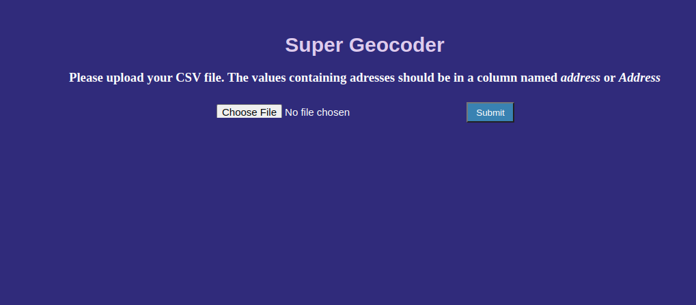

# Heroku Python Web-App
This is a repository for the Geography Web App. The application can calculate Longitute and Latitude, according to the address/Address column (from CSV file) and append these data to the file.

## Desktop application that I used for coding part
```
Visual Studio Code
```

## Framework used for deploying the Web App
```
Flask
```

## Web hosting service
```
[Heroku](https://www.heroku.com/)
```

## Web application link
```
[Geography Web App](https://geography-web-app.herokuapp.com/)
```

## App idea:
```
App created according to the Udemy lesson by Ardit Sulce.
```
## App Images:

